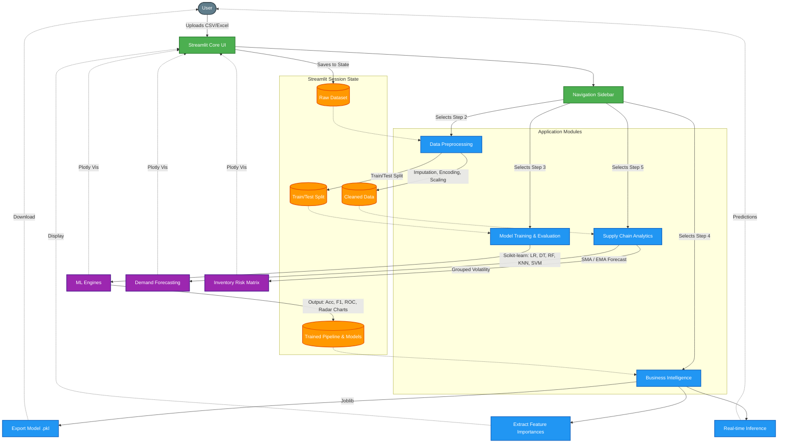

# AutoML Web Dashboard Architecture

This architecture diagram illustrates the flow of data and interaction between the underlying modules of your Streamlit application. 

### Component Details
- **User Interface Layer**: Built completely in Streamlit, driven by a Sidebar navigation system.
- **Session State Management**: Serves as the database/memory for the app, storing uploaded raw data, cleaned features, training splits, and model artifacts as the user progresses through different pages.
- **Data Preprocessing**: Handles missing values, performs one-hot/label encoding, applies MinMax/Standard scaling, and manages the Train/Test partitioning.
- **Model Training**: Incorporates Scikit-Learn classifiers. Generates robust classification metrics, confusion matrices, and ROC/PR charts using Plotly.
- **Business Intelligence**: Takes the best performing model from the training phase to deduce feature impact. Also supports real-time new data inferences and model downloads using `joblib`.
- **Supply Chain Analytics**: An independent module that uses the cleaned data to calculate historical Moving Averages (SMA/EMA) and inventory volatility maps for demand analysis.
