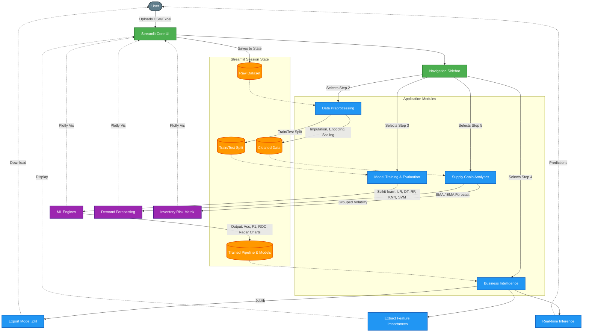

# AutoML Web Dashboard

This Streamlit AutoML Web Dashboard enables users to upload datasets, automate data preprocessing, and train/evaluate various ML models. It features interactive performance charts, actionable BI insights, model export capabilities, and supply chain analytics for demand forecasting and inventory risk assessment.

## Quick Start: Copy & Paste in Terminal

Run the following commands in your terminal to clone the repository, install dependencies, and start the application:

```bash
# Clone the repository
git clone https://github.com/Akshay-Notfound/AutoML-Web-Dashboard.git

# Navigate to the project directory
cd AutoML-Web-Dashboard

# Create a virtual environment (optional but recommended)
python -m venv .venv

# Activate the virtual environment
# On Windows:
.venv\Scripts\activate
# On macOS/Linux:
# source .venv/bin/activate

# Install the required dependencies
pip install -r requirements.txt

# Run the Streamlit application
streamlit run app.py
```

## Features Complete Guide

- **Data Upload**: Supports CSV and Excel file formats.
- **Data Preprocessing**: Handling missing values, categorical encoding, feature scaling, and train-test splits.
- **Model Training & Evaluation**: Train Logistic Regression, Decision Tree, Random Forest, KNN, and SVM models. Compare performance using Accuracy, Precision, Recall, and F1 Score with interactive charts.
- **Business Intelligence (BI) Insights**: Extract actionable insights based on feature importance and model reliability. Export the best model for future use.
- **Supply Chain Analytics**: Built-in demand forecasting (Moving Average & Exponential Smoothing) and inventory volatility & risk analysis matrix.

## Architecture

This architecture diagram illustrates the flow of data and interaction between the underlying modules of the Streamlit application.


