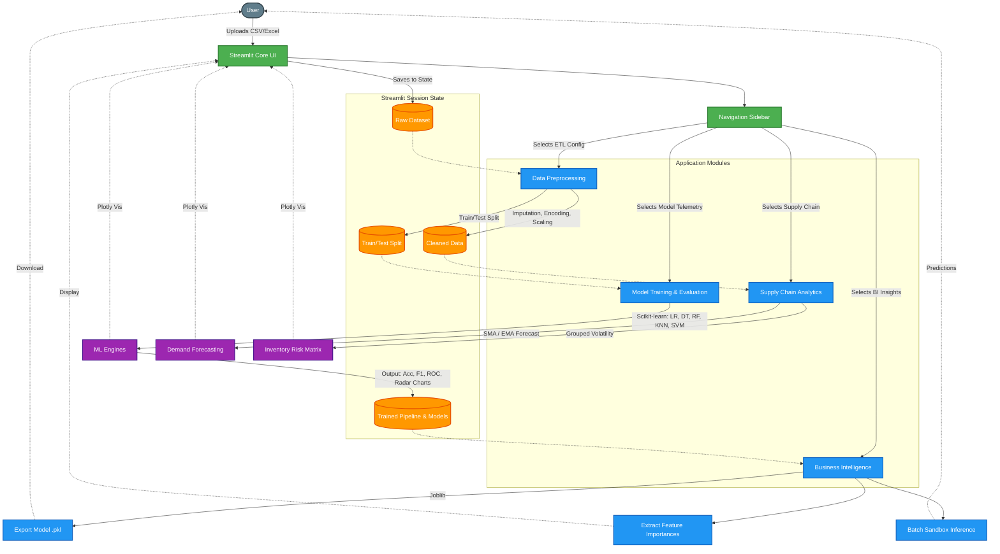

# AutoML Web Dashboard: Intelligent Analytics & Forecasting Command Center 🚀

This **Streamlit AutoML Web Dashboard** is a comprehensive, end-to-end Machine Learning web application designed for data ingestion, automated preprocessing, predictive modeling, and business intelligence (BI). It empowers users to move from raw data to actionable insights and supply chain forecasts in a matter of clicks—without writing a single line of code.

---

## 🌟 Core System Modules

The dashboard is structured into five cohesive "Command Center" modules:

1. **Data Ingestion Terminal:** Real-time data batch streaming (CSV/Excel) featuring automated schema telemetry, initial memory usage stats, and missing value detection. 
2. **ETL Pipeline Config:** A structured data transformation wizard allowing you to handle missing values, encode categorical constraints (Label & One-hot), normalize numerical features (Standard & MinMax), and instantly partition the training/holdout sets.
3. **Live Model Telemetry:** The AI engine. Compiles, trains, and evaluates multiple predictive algorithms simultaneously.
4. **BI Command Center:** Model interpretation interface. Translates raw predictions into actionable strategy, highlighting feature importance and letting you export the trained agent (`.pkl`) for production limits.
5. **Supply Chain Forecasting:** Tailored macro-analytics that project temporal demand (stochastic forecasting) and assess inventory item volatility.

---

## 🧠 Machine Learning Algorithms Integrated

The system utilizes an array of powerful `scikit-learn` algorithms. When you initiate the "Training Sequence," the application tests them head-to-head for your specific dataset.

### 1. Logistic Regression
* **What it is:** A foundational statistical model that uses a logistic function to model a binary dependent variable.
* **Algorithm details:** Calculates the probability of a target state by fitting data to a sigmoid curve. Highly interpretable, very fast, and extremely effective for linearly separable classification problems.

### 2. Decision Tree Classifier
* **What it is:** A non-parametric supervised learning method.
* **Algorithm details:** It splits the dataset into subsets based on the most significant data attributes (using metrics like Gini impurity or Information Gain) until an outcome prediction is isolated. It is highly interpretable but can be prone to overfitting.

### 3. Random Forest Classifier
* **What it is:** An ensemble learning method.
* **Algorithm details:** Constructs a multitude of decision trees at training time (using bagging and random feature selection) and outputs the mode of the classes (the consensus prediction) of the individual trees. It corrects the decision tree's habit of overfitting to its training set.

### 4. K-Nearest Neighbors (KNN)
* **What it is:** An instance-based "lazy learning" algorithm.
* **Algorithm details:** Predicts the class of a data point based on how its "neighbors" are classified. It measures the Euclidean distance to the `k` closest training examples and assigns the majority class. Effective for pattern recognition.

### 5. Support Vector Machine (SVC)
* **What it is:** A robust, margin-maximizing classifier.
* **Algorithm details:** It maps data into a high-dimensional feature space (often using an RBF kernel) so that data points of separate categories are divided by a clear gap that is as wide as possible. Excellent in complex dimensional spaces.

---

## 📦 Supply Chain Analytics Highlights

* **Temporal Pattern Matching (Moving Averages):** Calculates Simple Moving Averages (SMA) to smooth out short-term fluctuations and highlight longer-term supply chain trends.
* **Exponential Smoothing (EMA):** Applies weighting factors that decrease exponentially. This algorithm gives more importance to recent demand data, tracking recent anomalies accurately in supply chain consumption.
* **Inventory Volatility matrix:** Computes standard deviations against aggregate sums of specific SKUs to generate an active risk matrix. High-volume & high-volatility items are flagged for increased "safety stock."

---

## 🛠️ Quick Start: Installation & Execution

Run the following commands in your terminal to clone the repository, install dependencies, and start the application:

```bash
# Clone the repository
git clone https://github.com/Akshay-Notfound/AutoML-Web-Dashboard.git

# Navigate to the project directory
cd AutoML-Web-Dashboard

# Create a virtual environment (optional but recommended)
python -m venv .venv

# Activate the virtual environment
# On Windows:
.venv\Scripts\activate
# On macOS/Linux:
# source .venv/bin/activate

# Install the required dependencies
pip install -r requirements.txt

# Run the Streamlit application
streamlit run app.py
```

---

## 🏗️ Architecture Diagram

This architecture illustrates the flow of data and interaction between the underlying modules of the Streamlit application.


